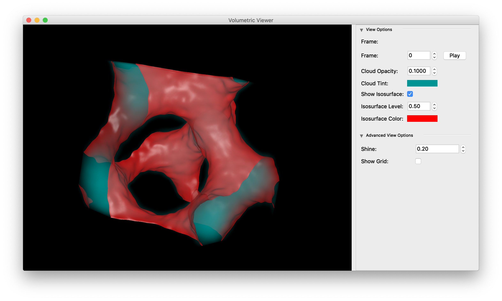

# Setup

### Mac / Linux

To install the package in developer mode:

```shell
$ git clone https://github.com/klecknerlab/muvi
$ cd muvi
$ python setup.py develop
```

To install the package in the regular manner (not recommended, code is
under active development!):

```shell
$ git clone https://github.com/klecknerlab/muvi
$ cd muvi
$ python setup.py install
```

In order to run the tools, you will need several Python packages installed, including:
  * numpy
  * pytables (https://www.pytables.org/)
  * pyQt5

This is easiest to do with some sort of package manager; the utilities are being
developed using Anaconda (https://www.anaconda.com/).  Note that the only
Python 3.X is supported.

Assuming you have Anaconda installed, you can get the require packages with:

```shell
$ conda install pytables pyqt
```

### Windows

You should be able to download the package directly from the Git repo and run `setup.py` as above.  More detailed directions coming soon.

---

# Usage

To create and view an example volume:

```shell
$ cd [MUVI DIR]/util
$ python generate_gyroid.py ~/gyroid.h5
$ python view.py ~/gyroid.h5
```



To convert a Phantom CINE file to compressed HDF5 volume:

```shell
$ cd [MUVI DIR]/util
$ python convert_cine.py [INPUT FILE] -s [FRAMES PER SCAN] -v [LIVE FRAMES PER VOLUME]
$ python view.py [OUTPUT FILE]
```

By default, the output filename is the same as the input with an `.h5` extension.  There are also more options in the conversion utility, which you can view with:

```shell
$ cd [MUVI DIR]/util
$ python convert_cine.py --help

usage: convert_cine.py [-h] [-v VOLUME] [-s SCAN] [-o OFFSET] [-c CLIP]
                       [-m MAX] [-g] [-n NUMBER]
                       infile [outfile]

Convert a CINE file to a .h5 movie

positional arguments:
  infile                Input CINE file
  outfile               Output HDF5 file

optional arguments:
  -h, --help            show this help message and exit
  -v VOLUME, --volume VOLUME
                        Number of frames per volume (should be <= # per scan)
  -s SCAN, --scan SCAN  Number of frames per scan
  -o OFFSET, --offset OFFSET
                        Offset to first valid frame
  -c CLIP, --clip CLIP  Noise clip value (default: 80; good for 10 bit images)
  -m MAX, --max MAX     Max value after clipping (default: use full dynamic
                        range
  -g, --gamma           If specified, apply 2.0 gamma correction
  -n NUMBER, --number NUMBER
                        Number of volumes to output (default: all)
```


> It is very likely you will want to specify at least the `clip`  and `max` values.  To test a volume, you can use the `number` option to output a single frame first.

---

# Features

This project is currently in active development.
A number of features are currently planned:

- [x] Volume rendering
- [x] Isosurface viewing
- [x] HDF5 input format
- [x] CINE conversion
- [ ] Conversion GUI
- [ ] Display perspective correction
- [ ] Support for perspective in old "S4D" format  
- [ ] Perspective correction on volumes in memory (for external processing)
- [ ] Image export (high res)
- [ ] Movie export
- [ ] Multithreaded display code (to avoid hang ups)
- [ ] Labelled axes
- [ ] Standalone Mac App
- [ ] Standalone Windows App
- [ ] Create Wiki with lots of practical examples


---

# License

Copyright 2019 Dustin Kleckner

Licensed under the Apache License, Version 2.0 (the "License");
you may not use this file except in compliance with the License.
You may obtain a copy of the License at: http://www.apache.org/licenses/LICENSE-2.0

Unless required by applicable law or agreed to in writing, software
distributed under the License is distributed on an "AS IS" BASIS,
WITHOUT WARRANTIES OR CONDITIONS OF ANY KIND, either express or implied.
See the License for the specific language governing permissions and
limitations under the License.
