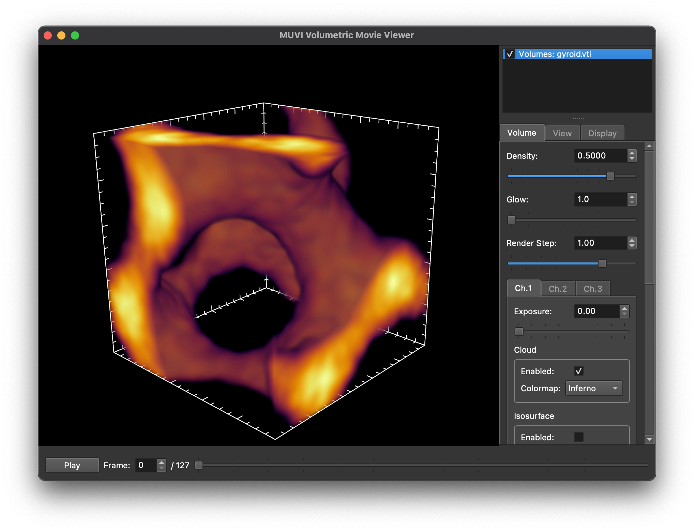

# Setup

## Windows Instructions

### Prerequisites

If you don't already have a Python distribution, you will need to download one
first.  We recommend "Anaconda", as it includes many of the required packages
already (and is widely used for data analysis in many fields).

We also need to install the following Python packages:
  * pyQt5
  * pyopengl
  * lz4
  * numba

We can also do this from a command console.  To do this, open `Anconda
Powershell Prompt` in **administrator mode**.  (Right click on the program
in the start menu and select `Run as administrator`.)
```shell
conda install numba lz4 pyopengl pyqt
```

You can also do this from the `Anaconda Navigator Program`.

### Downloading and Installing the Python Module.

You will also need a method to download the Github repository.  There are
several ways to do this, but perhaps the easiest is to use the programming
editor [Atom](https://atom.io/).  Once atom is installed, you can check out
the repository using the following procedure in Atom:
  * Open the command palette: `Ctrl`+`Shift`+`p`
  * Type `"clone"` + `Enter`, and select `Github: Clone`
  * Enter the following URL into the box: https://github.com/klecknerlab/muvi
  * If you wish, change the target directory and click `Clone`

You have now downloaded the Python repository.  We need to install it, which
is easiest to do from a console window.  If you are using Anaconda, open the
`Anconda Powershell Prompt` from the start menu (it should **not** be in
administrator mode).  Then enter the following commands:
```shell
cd github\muvi
python setup.py develop
```
**Note**: This commands assume you cloned the repository into the `[USER]\github\muvi`
directory, which is the default for Atom.

This will install the module in *developer mode*, which means that it leaves
all the files in the original directory, instead of copying them to the Python
directory.  This is recommended currently, as this code is under active
development, and may have frequent updates.  **Note:** If you update the
repository or change the code while in developed mode, it will affect the
module when imported by other scripts!  In this case, this is desirable, but
don't delete this directory after installing!

You can now run the examples below from the powershell prompt.  If you used
the defaults, your muvi directory is  `~\github\muvi`

## Mac / Linux

**Note:** The software is being actively developed and tested on Mac OS X, but not in Linux.  It should *probably* work, but may have some minor bugs.  If you run into any issues, please reach out!

### Dependencies

In order to run the tools, you will need several Python packages installed, including:
  * numpy
  * pyQt5
  * pyopengl
  * lz4
  * numba

This is easiest to do with some sort of package manager; the code is being developed using Anaconda (https://www.anaconda.com/).  Note that the only Python 3.X is supported.

Assuming you have Anaconda installed, you can get the require packages with:

```shell
$ conda install numba lz4 pyopengl pyqt
```

### Installing the Package in Developer Mode

```shell
$ git clone https://github.com/klecknerlab/muvi
$ cd muvi
$ python setup.py develop
```

### Installing as a Regular Package

*This is not recommended, code is under active development!*

```shell
$ git clone https://github.com/klecknerlab/muvi
$ cd muvi
$ python setup.py install
```

### Updating the Package

If the package is installed in developer mode, any changes to the code in the package folder will immediately affect the module.
To update the package, just pull from the master github repository.

In Atom, you can do this by opening the main project directory (if you just opened Atom, select `Add Project Folder` from the `File` menu, and then select the `muvi` base directory (by default on Windows this is `[USER]\github\muvi`).
The click the `Fetch` button on the lower right of the Atom window.
If updates are available, this will button will change to `Pull`; click again and you should have the updates.

# Usage

## Simple Example

To create and view an example volume:

```shell
$ cd [MUVI DIR]/examples
$ python generate_gyroid.py
$ muvi gyroid.vti
```



Alternatively, there is a sample frame from a real experiment in the same directory, it can be viewed with:

```shell
$ muvi [MUVI DIR]/samples/sample_frame.vti
```

Note also that you can drag and drop files into the Muvi Viewer window, which will automatically display them.

## Introduction to the viewer.

The viewer has a few main parts:
 * **Rendered data:** the main portion of the window.
 * **Data selector:** top-right of the window.  This allows you to select which data is displayed, and add/remove files.  Right click on a data item to get more options.  Also, if you select an item (left click on it), it's display options will be shown in the panel below.
 * **Display options:** center-right of the window.  This displays all the adjustable options for the rendering of the data.  Note that the first tab is specific to the data item you have selected above.
 * **Playback controls:** bottom of the window.  Note that playback speed is controlled in the "View" tab of the display options.

If you would like to export an image, you can open the export window with `Ctrl+E` (`Cmd+E` on Mac).

You can also hide/show the right panel with `Ctrl+/` (`Cmd+/` on Mac).

Most of the display options include "tooltips" -- if you hover the cursor over the controls it will give you more information on what it does.

## Converting a 2D Movie to 3D

To convert a Phantom CINE file to compressed VTI volume, you need to first generate a XML file which contains the VolumeProperties info.  This will allow you to define the number of frames per volume and other important properties.  To do this, copy the `samples/muvi_setup.xml` file (copied below) to the same directory as your 2D movie source files.  If you leave the name as is, it will be automatically used by every file conversion in that directory.  Alternatively, if you give it the same name as your source file (apart from the extension), this will be used for that specific file only.

```xml
<?xml version="1.0" encoding="UTF-8"?>
<VolumeProperties>
    <!-- Number of frames in a volume -->
    <int name="Nz">256</int>
    <!-- Nx/Ny don't need to be specified, determined automatically -->

    <!-- Number of frames in a scan, must satisfy Ns >= Nz -->
    <int name="Ns">300</int>

    <!-- Dark clip value; default works well for Cine files -->
    <float name="dark_clip">0.005</float>

    <!-- If desired, you can also limit the upper end brightness.  This is the
    level in the raw file which is converted to the brightest value.  The
    default below is the correct value for Phantom cameras.  In most situations
    it should probably be left alone.  Note that you would also need to adjust
    the dark_clip if you change the white_level!
    -->
    <!-- <int name="white_level">4064</int>-->

    <!-- Gamma correction.  If gamma = 2, stored value is sqrt of input -->
    <float name="gamma">2.0</float>

    <!-- Physical size of volume on each axis -->
    <int name="Lx">100</int>
    <int name="Ly">100</int>
    <int name="Lz">100</int>

    <!-- Uncomment these lines if distortion correction will be used.  Note
        that the units of dx/dz are the same as L -->
    <!--
        <int name="dx">200</int>
        <int name="dz">200</int>
    -->

    <!-- Units of L -->
    <str name="units">mm</str>
</VolumeProperties>
```

**Note:** If your 3D frames are trigger only during the active scan region,  you can comment out the `Ns` and `Nz` entries.  The software will automatically determine the volume depth by analyzing the frame timings!

Additionally, there are two utilities in the `util` directory which are useful for determining the properties of Cine files:

* `cine_histo.py`: This will sample the input cine file and create a histogram of the brightness levels.  Can be used to determine the appropriate `dark_clip` level.  (Although the default is usually sufficient.)
* `frame_delta.py`: This will analyze the first 1500 frames to try to find the "turn-around" of the laser scanner.  Can be used to determine the number of frames in a scan (`Ns`) and the offset (`offset`).  (**Note:** this utility is obsolete in practice; if you don't specify `Ns` or `Nz`, this analysis is automatic!)

To convert your video file, use the installed `muvi_convert` shell command to generate the `.vti` file, and `muvi` to view it:

```shell
$ muvi_convert [INPUT FILE] [OUTPUT FILE]
$ muvi [OUTPUT FILE]
```

By default, the output filename is the same as the input with an `.vti`
extension.  There are also more options in the conversion utility, which you
can view with:

```shell
$ muvi_convert --help
usage: muvi_convert [-h] [-x XML] [-s START] [-e END] infile [outfile]

Convert a CINE file to a VTI movie

positional arguments:
  infile                Input CINE file
  outfile               Output VTI file

optional arguments:
  -h, --help            show this help message and exit
  -x XML, --xml XML     XML file to use for conversion parameters
  -s START, --start START
                        First volume index to convert (default: 0)
  -e END, --end END     Last volume index to convert (default: all volumes
                        converted)
```

# Features

This project is currently in active development.
A number of features are currently planned:

- [x] Volume rendering
- [x] Isosurface viewing
- [x] Mesh overlay
- [x] Tools to generate glyphs (arrows, points, etc.) for overlays
- [x] VTI file writing
- [x] VTI file reading
- [ ] VTI reading from other sources
- [x] CINE conversion
- [ ] SEQ conversion
- [ ] Conversion GUI
- [x] Display perspective correction
- [x] Multichannel support (partial)
- [ ] Support for perspective in old "S4D" format  
- [ ] Perspective correction on volumes in memory (for external processing)
- [x] Image export (high res)
- [ ] Movie export
- [ ] Asyncronous display code (to avoid hang ups)
- [ ] Labeled axes
- [ ] Create Wiki with practical examples


---

# License

Copyright 2021 Dustin Kleckner

Licensed under the Apache License, Version 2.0 (the "License");
you may not use this file except in compliance with the License.
You may obtain a copy of the License at: http://www.apache.org/licenses/LICENSE-2.0

Unless required by applicable law or agreed to in writing, software
distributed under the License is distributed on an "AS IS" BASIS,
WITHOUT WARRANTIES OR CONDITIONS OF ANY KIND, either express or implied.
See the License for the specific language governing permissions and
limitations under the License.
